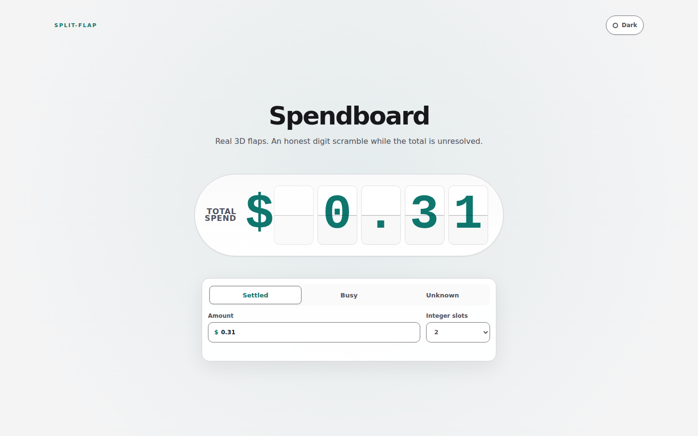
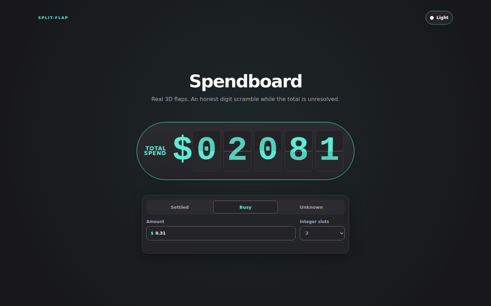

# Spendboard

A reusable React split-flap component for showing settled, busy, and unknown spend.

[Live demo](https://rarestg.github.io/spendboard-react/)

| Light · settled | Dark · busy |
| --- | --- |
|  |  |

## Use it

This repository ships TypeScript and CSS Modules source, not a registry package or prebuilt `dist`. Copy `src/` into a compatible app, or install this repository by its Git URL; either way, the consuming bundler must handle TypeScript and CSS Modules. Adjust the import path if you copy the source.

```sh
npm install github:rarestg/spendboard-react
```

```tsx
import { Spendboard } from "spendboard-react";

<Spendboard status="settled" cents={31} /> // $0.31
<Spendboard status="busy" />
<Spendboard status="unknown" />
```

Amounts use integer cents, avoiding fractional currency input.

| Prop | Type | Default | Notes |
| --- | --- | --- | --- |
| `status` | `"settled" \| "busy" \| "unknown"` | required | Display state and union discriminant |
| `cents` | `number` | — | Required only for `settled`; a non-negative safe integer that fits the selected panels |
| `integerSlots` | `1 \| 2 \| 3 \| 4` | `2` | Fixed integer capacity; one panel fits up to $9.99 |
| `presentationOnly` | `boolean` | `false` | Defers naming and announcements to an accessible outer control |
| `className` | `string` | — | Optional wrapper class |
| `style` | `React.CSSProperties` | — | Optional wrapper styles |

Scale the display from its cell height:

```css
.compact {
  --sf-cell-height: 20px;
}
```

## Behavior and accessibility

The unresolved scramble is a status treatment, not a live count-up, and `unknown` never presents zero as a real value. Animation pauses while the document is hidden. Reduced-motion users get a static state. A settled milestone is announced once through a live region instead of exposing every intermediate flap. Use `presentationOnly` inside an existing accessible control to render an `aria-hidden` board without a second live region.

## Prior art

These are technique and design credits; no upstream source is included here.

| Reference | Take / change / reject |
| --- | --- |
| [fx.hot.page demo](https://fx.hot.page/split-flap) and [source](https://fx.hot.page/split-flap/source) | Adapted the four-face, clipped Web Animations model; narrowed a generic web component/grid into a fixed money status. |
| [paulcuth/departure-board](https://github.com/paulcuth/departure-board) | Kept the departure-board surface and center seam; replaced interval-driven flips and prefixed global CSS with WAAPI and CSS Modules. |
| [veltman split-flap gist](https://gist.github.com/veltman/f2b2a06d4ffa62f4d39d5ebac5ceeef0) | Used its slow-to-fast cyclic idea only; no source copied. Replaced D3 and infinite motion with bounded, state-driven reels. |
| [northcoder-repo/split-flap-demo](https://github.com/northcoder-repo/split-flap-demo) | Used its small-size seam warning as a comparison; rejected delayed two-half DOM swaps. |

## Development

```sh
npm install
npm run dev
npm run test
npm run build
```

## In the wild

Spendboard powers the spend tracker at [🍌 BYOBanana](https://byobanana.com), an AI image generator where you can bring your own API key and use Google's Nano Banana models.

## License

[MIT](LICENSE) © 2026 Rares Gosman. See [third-party notices](THIRD_PARTY_NOTICES.md).
